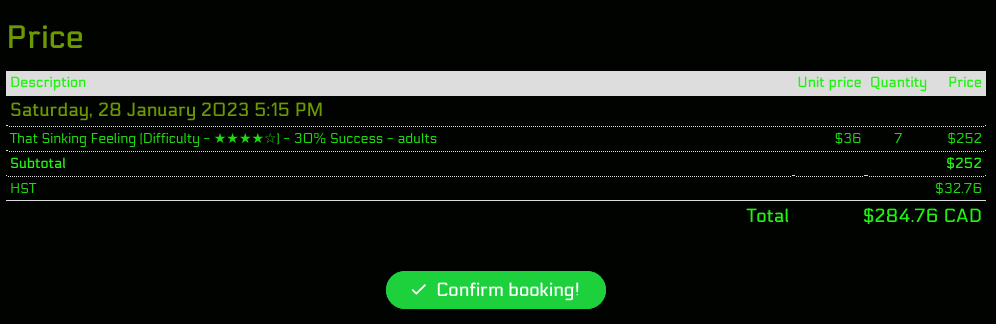

# Control Alt Elite | University of Toronto Anonymization API
> _Note:_ This document will evolve throughout your project. You commit regularly to this file while working on the project (especially edits/additions/deletions to the _Highlights_ section). 
 > **This document will serve as a master plan between your team, your partner and your TA.**

## Product Details
 
#### Q1: What is the product?

 > Short (1 - 2 min' read)
 * Start with a single sentence, high-level description of the product.
 * Be clear - Describe the problem you are solving in simple terms.
 * Specify if you have a partner and who they are.
 * Be concrete. For example:
    * What are you planning to build? Is it a website, mobile app, browser extension, command-line app, etc.?      
    * When describing the problem/need, give concrete examples of common use cases.
    * Assume your the reader knows nothing about the partner or the problem domain and provide the necessary context. 
 * Focus on *what* your product does, and avoid discussing *how* you're going to implement it.      
   For example: This is not the time or the place to talk about which programming language and/or framework you are planning to use.
 * **Feel free (and very much encouraged) to include useful diagrams, mock-ups and/or links**.

The product is a robust and straightforward rest API that allows university faculty to efficiently anonymize sensitive data, e.g. student peer reviews. The problem that many faculty members face is the handling of this data: often, it needs to be processed in large quantities and stored anonymously. Manually anonymizing this data is not only needlessly laborious, but it is also a privacy concern, because students expect that their answers are kept confidential.

Our product will facilitate the anonymization of this data by way of a rest API. This will provide a flexible interface for faculty to use our product, regardless of what technology they are using. Our product will be able to anonymize a list of text fields, given the sensitive data (names), and the terms to replace them with. Our product will also have the capability to anonymize spreadsheets via csv upload, with a target column and the value to replace the sensitive data with.

#### Q2: Who are your target users?

  > Short (1 - 2 min' read max)
 * Be specific (e.g. a 'a third-year university student studying Computer Science' and not 'a student')
 * **Feel free to use personas. You can create your personas as part of this Markdown file, or add a link to an external site (for example, [Xtensio](https://xtensio.com/user-persona/)).**

Partner Pete: 26 Year old Manager working at small software Company with a Bachelor's in Computer Science. He tends to take on a lot so he generally has a busy schedule, partially because of the small size of his team. However, as manager he has plenty of experience working and communicating with different people. 

Scenario: His company has a small staff, so he uses the CSC301 partnership program in order to get an important project done for the company. He wants to leave a testimonial where he discusses the team he was partnered with and his experience with the partnership program. However, he is very busy and does not have the time to edit out or write around sensitive information such as teammate and course staff names.  

Teamwork Tom: Tom is a 21 year old Computer Science student in his third year pursuing a degree at the University of Toronto. he is a hard worker, and having worked in many group projects before, he will not hesitate to communicate any grievances he has with teammates that are difficult to work with or whom do not pull their weight. However, he will also take the time to leave positive feedback for teammates he finds success with. 

Scenario: Tom has just finished his CSC301 Partnership Program project with a small team of 6. He wants to be able to leave an honest peer evaluation regarding the good and bad experiences he has had with his group. However, he is taking many CS courses this semester and does not have the time to look up the appropriate regulations within the course regarding the anonymity of his teammates in peer reviews. Ideally he would just write what he thinks, and submit it. 

 - University professors
 - University IT professionals
 - University software developers

#### Q3: Why would your users choose your product? What are they using today to solve their problem/need?

> Short (1 - 2 min' read max)
 * We want you to "connect the dots" for us - Why does your product (as described in your answer to Q1) fits the needs of your users (as described in your answer to Q2)?
 * Explain the benefits of your product explicitly & clearly. For example:
    * Save users time (how and how much?)
    * Allow users to discover new information (which information? And, why couldn't they discover it before?)
    * Provide users with more accurate and/or informative data (what kind of data? Why is it useful to them?)
    * Does this application exist in another form? If so, how does your differ and provide value to the users?
    * How does this align with your partner's organization's values/mission/mandate?

Users will choose our product because:

- It guarantees that sensitive data is not stored anywhere. This is important because it allows our user’s and their customers to be assured about the confidentiality their information.
- It saves time. Instead of users manually finding personally identifiable data, our product will automate this process and apply anonymization techniques to the types they specify.
- Our API’s will be flexible and support a variety of anonymization techniques, which can be indicated by the user in the request body. This provides our users with a diverse approach towards how they might want to anonymize their data. For example, they may choose “Data Masking”, which can replace the data they want with alternative characters.
- We also plan to investigate adding a higher level of automation via AI/NLP to find personally identifiable information, and anonymize it.

Besides cases where sensitive data is stored in plain text, most people are designing their own code to handle anonymizing their unique datasets using the following methods:

- Data Masking: The process of altering values to hide the original data. Altering techniques include character shuffling, encryption, and character substitution.
- Pseudonymization: Replacing private data with pseudonyms, also known as fake identifiers. For example, a common pseudonym is John Smith, which can be used to replace someone's first and last name.
- Generalization: Making the data less specific by removing or replacing parts of the data, but keeping the rest. For example, we can remove the house number in an address, but keep the road name.
- Data Swapping: Shuffling the dataset by rearranging rows or columns.
- Perturbation: Randomly modifying sensitive data, such as by rounding or multiplying numerical values or replacing words with synonyms.
- Synthetic Data: Replacing sensitive data with data that resembles the original.
- Encryption: Using algorithms to make data uninterpretable. However, encryption algorithms can be decrypted into the original data.

**Example: Original Data**
| lastName    | firstName | age |  SIN        | creditCard           | 
| ----------- | --------- | --- | ----------- | -------------------- |
| Rahman      | Rafee     | 20  | 999888777   | 1234 4567 8910 1112  |

**Example: New Data (name is pseudonymized, age is generalized, SIN and creditCard are masked)**
| lastName    | firstName | age |  SIN        | creditCard           | 
| ----------- | --------- | --- | ----------- | -------------------- |
| Smith      | John     | < 30  | @!*^#@$!(  | XXXX XXXX XXXX XXXX  |

There are some libraries out there that people may use to anonymize their data such as pynonymizer and Faker. The pynonimizer library only supports pseudonymization by using the Faker library to generate random pseudonyms for attributes like e-mails, names, and more. However, institutions cannot rely on libraries because they must follow strict GDPR regulations, and similarly may not trust third-party software.  

By providing flexible anonymization methods, we will support our project partner’s goal of creating an automated and seamless process of anonymizing data following GDPR guidelines for organizational needs.

#### Q4: What are the user stories that make up the Minumum Viable Product (MVP)?

 * At least 5 user stories concerning the main features of the application - note that this can broken down further
 * You must follow proper user story format (as taught in lecture) ```As a <user of the app>, I want to <do something in the app> in order to <accomplish some goal>```
 * User stories must contain acceptance criteria. Examples of user stories with different formats can be found here: https://www.justinmind.com/blog/user-story-examples/. **It is important that you provide a link to an artifact containing your user stories**.
 * If you have a partner, these must be reviewed and accepted by them. You need to include the evidence of partner approval (e.g., screenshot from email) or at least communication to the partner (e.g., email you sent)

#### User Story 1: General Anonymization
 **As a** Partner that will own and distribute the project.
 
 **I want to** posses an unbreakable and efficient program that will anonymize the data provided for the client.
 
 **so that** I can use for my own work and provide to the public for their own use.
 
**Acceptance Criteria:** The project anonymized the provided data, given every edge case, in a elegant and efficient manner.

**Given** that the partner is interested in possessing such a project,

**When** the project is not up to their standard,

**Then**
1. The partner and the team will meet for the issues to be communicated
2. The team will solve the issues and test the program
3. The team will present the new solution to the partner for review

#### User Story 2: CSV Anonymization

**As a** PhD student conducting a research experiment about improving student’s mental health,

**I want to** anonymize a spreadsheet containing personally identifiable data such as survey respondent names, student numbers, and e-mails

**so that** I can provide this spreadsheet to my research assistants to conduct analyses on the data.

 **Acceptance Criteria:**

**Given** that the PhD student wants to anonymize some data,

**When** they send a request to our API route with the CSV, names of columns to anonymize, and the anonymization technique name,

**Then**
1.  On response code 200, a CSV with the anonymized data should be returned. It must match the columns that they wanted anonymized and the anonymization technique they specified.
2.  On response code 400, a message stating “Bad Request” is returned.
3.  On response code 404, a message stating “Server Error” is returned.

#### User Story 3: Regex Anonymization

**As a** shipping manager at a campus book store,

**I want to** anonymize credit card numbers on incoming orders

**so that** the workers can view order details without any confidential information included.

 **Acceptance Criteria:**

**Given** that the manager wishes to anonymize all the credit card values in their dataset

**When** they send a request to our API route with their dataset and a regex that identifies different credit cards formats

**Then**
1.  On response code 200, a dataset that matches the original with the exception of all card values identified by the given regex statement
2.  On response code 400, a message stating “Bad Request” is returned.
3.  On response code 404, a message stating “Server Error” is returned.

#### User Story 4: Ambiguity Detection

**As a** instructor for a university course,

**I want to** collect student feedback at the end of the term, with awareness that possible formatting errors may be included

**so that** data can be anonymized when given to the class next semester.

 **Acceptance Criteria:**

**Given** that the instructor wishes to anonymize all names from the dataset, and assumes that common spelling or grammatical errors will occur (ex. missed capitalization)

**When** they send a request to our API route with the dataset and names they wanted anonymized

**Then**
1.  On response code 200, return a dataset that automatically catches and replaces minor spelling errors along with a brief summary of the instances where this was triggered
2.  On response code 400, a message stating “Bad Request” is returned.
3.  On response code 404, a message stating “Server Error” is returned.

#### User Story 5: GUI Response

**As a** university administrator with limited technical experience,

**I want to** find a simple and intuitive way to anonymize the names from a dataset of undergrad applicants,

**so that** the dataset can be sent to admission staff for review, without any possible name bias (ex. eliminate nepotism).

**Acceptance Criteria:**

**Given** that the admin wishes to anonymize their dataset and has no prior API experience

**When** they interact with our GUI, they can navigate the webpage, upload their document and intuitively configure it to fit their needs

**Then**
1.  On response a success message is displayed on the webpage, with a button allowing them to download their anonymized file
2.  On response, display a bad request 400 page that outlines their error.
3.  On response, display a bad request 404 page that notifies them of a wrong endpoint.
4.  On response, display a bad request 500 page that notifies them of a server error.
5.  On response, display a bad request 408 page that notifies them of a timeout error.

#### Q5: Have you decided on how you will build it? Share what you know now or tell us the options you are considering.

> Short (1-2 min' read max)
 * What is the technology stack? Specify languages, frameworks, libraries, PaaS products or tools to be used or being considered. 
 * How will you deploy the application?
 * Describe the architecture - what are the high level components or patterns you will use? Diagrams are useful here. 
 * Will you be using third party applications or APIs? If so, what are they?

We plan to build this API primarily using Flask, a python framework for web backends. Since this is a rest API, we plan to specifically use the flask-restful library as well to expedite development and focus more on processing the data.
Any future frontend implementations will likely be done in React.
We plan to deploy our application on a hosting service with a free tier, such as Heroku or Azure. This could be done directly, or within a docker container.
As for product architecture, we plan on having multiple endpoints to our API, with each having one or more methods to interact with it (GET, POST, etc). 
We do not expect to use any third party applications or APIs, assuming python libraries do not count as third party.


----
## Intellectual Property Confidentiality Agreement 
> Note this section is **not marked** but must be completed briefly if you have a partner. If you have any questions, please ask on Piazza.
>  
**By default, you own any work that you do as part of your coursework.** However, some partners may want you to keep the project confidential after the course is complete. As part of your first deliverable, you should discuss and agree upon an option with your partner. Examples include:
1. You can share the software and the code freely with anyone with or without a license, regardless of domain, for any use.
2. You can upload the code to GitHub or other similar publicly available domains.
3. You will only share the code under an open-source license with the partner but agree to not distribute it in any way to any other entity or individual. 
4. You will share the code under an open-source license and distribute it as you wish but only the partner can access the system deployed during the course.
5. You will only reference the work you did in your resume, interviews, etc. You agree to not share the code or software in any capacity with anyone unless your partner has agreed to it.

**Your partner cannot ask you to sign any legal agreements or documents pertaining to non-disclosure, confidentiality, IP ownership, etc.**

Briefly describe which option you have agreed to.

Our group has agreed to option two.

----

## Teamwork Details

#### Q6: Have you met with your team?

Do a team-building activity in-person or online. This can be playing an online game, meeting for bubble tea, lunch, or any other activity you all enjoy.
* Get to know each other on a more personal level.
* Provide a few sentences on what you did and share a picture or other evidence of your team building activity.
* Share at least three fun facts from members of you team (total not 3 for each member).

Our team met up last weekend to do an escape room at YorkVille called E-Exit, followed by dinner at a nearby korean restaurant. The escape room was fun and challenging, we nearly solved it within the time limit.



Fun facts:
- Nathan was born in Hawaii
- Sayna does Muay Thai
- Tian is a lockpick enthusiast


#### Q7: What are the roles & responsibilities on the team?

Describe the different roles on the team and the responsibilities associated with each role. 
 * Roles should reflect the structure of your team and be appropriate for your project. One person may have multiple roles.  
 * Add role(s) to your Team-[Team_Number]-[Team_Name].csv file on the main folder.
 * At least one person must be identified as the dedicated partner liaison. They need to have great organization and communication skills.
 * Everyone must contribute to code. Students who don't contribute to code enough will receive a lower mark at the end of the term.

List each team member and:
 * A description of their role(s) and responsibilities including the components they'll work on and non-software related work
 * Why did you choose them to take that role? Specify if they are interested in learning that part, experienced in it, or any other reasons. Do no make things up. This part is not graded but may be reviewed later.

| Name | Role(s) | Responsibilities | Why |
| --- | --- | --- | --- |
| Nathan | Project Manager, Partner Liason, Backend Engineer | - Organize meetings and keep track of meeting minutes <br> - Assign tasks to team members <br> - Ensure team members are on track with their tasks  <br> - First point of contact with partner <br> - provide Flask and general backend expertise | - Experienced in Flask <br> - Interested in learning more about project management |
| Letian | DevOps Engineer, Algorithm Engineer | - Set up CI/CD pipeline <br> - Deploy application <br> - Provide Docker expertise <br> - Provide algorithm expertise | - Experienced in Docker <br> - Experienced in cloud services <br> - Interested in learning more about algorithms |
| Rafee | Frontend Engineer, Backend Engineer, QA Engineer | - Interested in learning about Flask and designing some of the API end points. <br> - Will help create frontend components and server-side requests for documentation. <br> - Once our algorithms are complete I will be responsible for creating tests. | - Have some experience with automated testing and API testings using Selenium and RESTAssured <br> - Experienced with React for Frontend, and Express for backend.
| Sayna | Backend Engineer, Frontend Engineer, Devops | - Backend development <br> - create test cases for back end <br> | - Interested in learning about Devops <br> - Exerience with Django <br> - Experience with React <br> - Intrested in building APIs <br>|
| Edward | Backend Engineer, Frontend Engineer, Algorithm Engineer | - Frontend development <br> - Interested in learning more good coding practices in REACT <br> | - Interested in learning about Algorithms for Anonymization <br> - Exerience with Django <br> - Experience with React <br> - Experience with REST APIs <br>|
| Jonathan | Backend Engineer, Frontend Engineer | - API architecture and development <br> - Frontend development <br> - Backend and frontend QA | - Intrested in expanding upon past web development experience <br> - Exerience with Django <br> - Exerience writing AI prompts and training models <br> |
| Mehrdad | Frontend Engineer, Backend Engineer, Algorithm Engineer| - Build frontend components <br> - Help with the design for endpoints <br>  | - Experience with React <br> - Experience with REST APIs <br> - Interested in working on the main algorithm |

The possible roles are:
- Project Manager
- Algorithm Engineer - this person will be responsible for the anonymization algorithm, using either a pre-existing algorithm or creating their own
- Backend Engineer - this person will be responsible for the backend API, using Flask
- Frontend Engineer - this person will be responsible for the frontend, using React
- DevOps Engineer - this person will be responsible for deploying the application, using cloud and container services. This person will also be responsible for setting up the CI/CD pipeline.
- Quality Assurance Engineer - this person will be responsible for creating testsuites for our API's and frontend.

Note that the number of roles is not fixed, and we may add or remove roles as needed. For example, if we decide to use a pre-existing algorithm, we may not need an algorithm engineer.

#### Q8: How will you work as a team?

Describe meetings (and other events) you are planning to have. 
 * When and where? Recurring or ad hoc? In-person or online?
 * What's the purpose of each meeting?
 * Other events could be coding sessions, code reviews, quick weekly sync meeting online, etc.
 * You should have 2 meetings with your project partner (if you have one) before D1 is due. Describe them here:
   * You must keep track of meeting minutes and add them to your repo under "documents/minutes" folder
   * You must have a regular meeting schedule established for the rest of the term.  

Our team plans to have one hour calls over Discord every Friday afternoon (we determined this is the time period where we all have the best availability). Each meeting, we will assess our current tasks, assign any unassigned tasks, and go over any upcoming project requirements. Meeting in person is not feasible weekly because a few of our members have a long commute. Things like coding sessions and reviews will be scheduled on the fly, since they require fewer people and are easier to coordinate.
  
#### Q9: How will you organize your team?

List/describe the artifacts you will produce in order to organize your team.       

 * Artifacts can be To-Do lists, Task boards, schedule(s), meeting minutes, etc.
 * We want to understand:
   * How do you keep track of what needs to get done? (You must grant your TA and partner access to systems you use to manage work)
   * **How do you prioritize tasks?**
   * How do tasks get assigned to team members?
   * How do you determine the status of work from inception to completion?

Our main artifact will be a GitHub Project board linked to our repository. Each new task will have a corresponding ticket, with any relevant sub-steps or sub-tasks included as needed. 
We will prioritize by having a "High Priority" column on our kanban board. This way, task assignees know which tickets to handle first.
Tasks will be assigned according to people's skills and availability. Our team members should be careful not to self-assign too much and ensure everyone is doing a fair share of work.

#### Q10: What are the rules regarding how your team works?

**Communications:**
 * What is the expected frequency? What methods/channels will be used? 
 * If you have a partner project, what is your process for communicating with your partner?

Currently, we have set up meetings on Fridays from 5-6, which will be held either on discord or Zoom. We currently communicate through discord primarily. We also communicate with our partner through email, but the members of our team with slack will communicate with our partner through slack for more urgent matters. 

**Collaboration: (Share your responses to Q8 & Q9 from A1)**
 * How are people held accountable for attending meetings, completing action items? Is there a moderator or process?
 * How will you address the issue if one person doesn't contribute or is not responsive? 

People will be held accountable for completing action items through the Github Projects tab, where different team members will be assigned tasks. 

Minutes from meetings and assigned actions will be recorded. Group members are generally expected to respond (to discord messages, generally) within 24-48 hours. Members who are not contributing or who are unresponsive will be followed up with first through discord, then though email or phone. If the issue doesn't get resolved, we'll have a meeting to discuss it and determine how best to proceed as a team. If the problem persists, we might need to enlist the assistance of a TA or the professor. 
