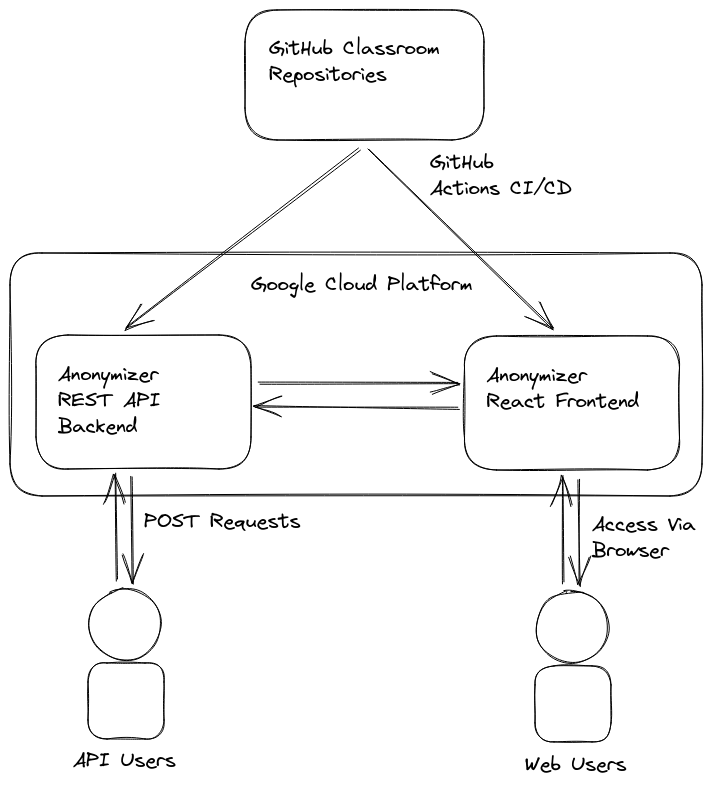

# 1. Summary of software

### a. paragraph for problem & partner

The product is a robust and straightforward rest API that allows university faculty to efficiently anonymize sensitive data, e.g. student peer reviews. The problem that many faculty members face is the handling of this data: often, it needs to be processed in large quantities and stored anonymously. Manually anonymizing this data is not only needlessly laborious, but it is also a privacy concern, because students expect that their answers are kept confidential.

Our product will facilitate the anonymization of this data by way of a rest API. This will provide a flexible interface for faculty to use our product, regardless of what technology they are using. Our product will be able to anonymize a list of text fields, given the sensitive data (names), and the terms to replace them with. Our product will also have the capability to anonymize spreadsheets via csv upload, with a target column and the value to replace the sensitive data with.

### b. paragraph existing any existing software/infrastructure (if applicable)

There are some libraries out there that people may use to anonymize their data such as pynonymizer and Faker. The pynonimizer library only supports one type of anonymization method, which is pseudonymization, by using the Faker library to generate random pseudonyms for attributes like e-mails, names, and more. Institutions  may want different anonymization methods, and they may not want to rely on these libraries because of the strict GDPR regulations they have to follow, and they also may not trust the third-party software.

By providing flexible anonymization methods, we will support our project partner’s goal of creating an automated and seamless process of anonymizing data following GDPR guidelines for organizational needs.

# 2. Division of project

For this assignment, our team split up into three sub-teams: backend, frontend, and devops. We knew we needed to each tackle one simple user story, so we decided to split up and work on the most functionally distinct user stories. Our backend team took on the user story that dealt with accessing the API directly with a tool such as Postman, and our frontend team started working on a simple, easy to use frontend for university staff who would be more comfortable accessing the application through a browser. At first, we did not have a user story which was related to devops. However, we agreed that automating software quality assurance and deployment is very valuable both for developers and end users of the application, and so a user story was created. When we were deciding how many people to allocate to each team, we initially thought it would make sense to have three people working on backend, and two people on both frontend and devops. However, after some discussion we realized that the React frontend we planned to build would require more initial effort to get started than our flask-restful backend. Fortunately, several of our team members were flexible enough to adapt to this need, which is how we arrived at a split of three frontend developers, two backend developers, and two devops developers.

### software architecture diagram

# 3. Paragraph for each sub-team

### Frontend

### Backend

For this assignment, the backend team created the foundation for the project backend, which includes the file structure, testing procedure, and the coding environment. We aimed to create
a modular file structure to be flexible to the addition of more Resources or external libraries.
There is one functional endpoint which takes in the string that is being anonymized along with a dictionary of key values, and returns an anonymized text. 
The backend testing was done through Postman, where every edge case was covered. The JSON file of the postman collection is also included in addition to all the backend code for future changes.

### Dev Ops

Our devops team is responsible for facilitating the containerization of both the application backend and frontend, the deployment of these containerized services to Google Cloud Platform (GCP), and the future communication between the backend and frontend services. We achieved application containerization  by writing Dockerfiles for each side of our application, and we successfully deployed these containers via GCP. The devops team is actively investigating means to connect the backend and frontend containers and facilitate full functionality.
